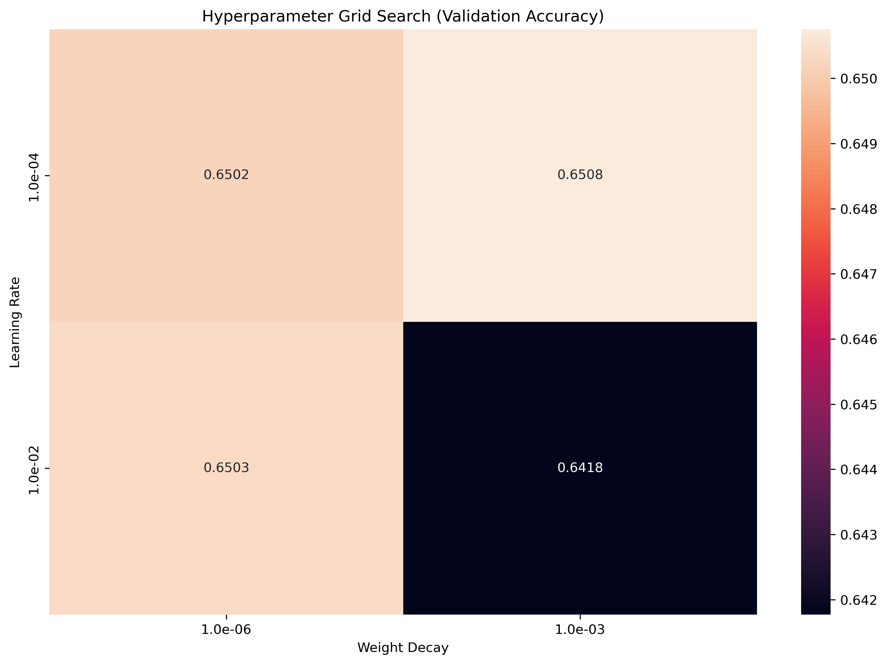
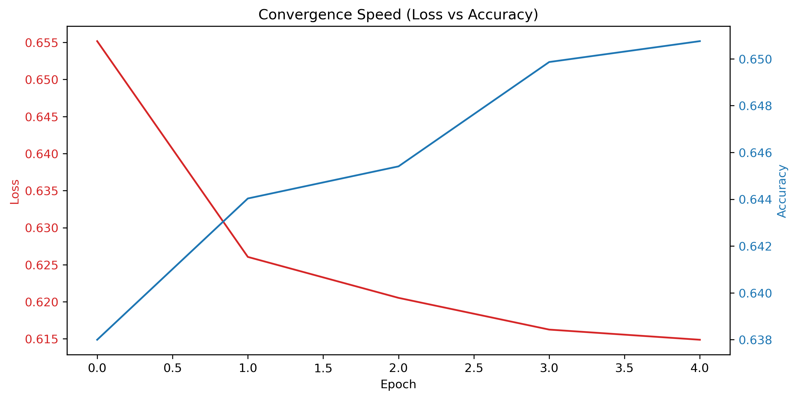

# Báo Cáo Kết Quả Huấn Luyện (Tennis Match Prediction)

## Siêu tham số tối ưu tìm được qua Grid Search
- **Learning Rate (LR):** 1.00e-04
- **Weight Decay (WD):** 1.00e-03
- **Độ chính xác Cross-Validation tốt nhất (Best CV Accuracy):** 0.6508

## Biểu đồ trực quan hóa

### Biểu đồ phân tích lưới siêu tham số (Hyperparameter Grid Search Heatmap)

### Biểu đồ đường cong học tập (Convergence Curves - Loss vs. Accuracy)

